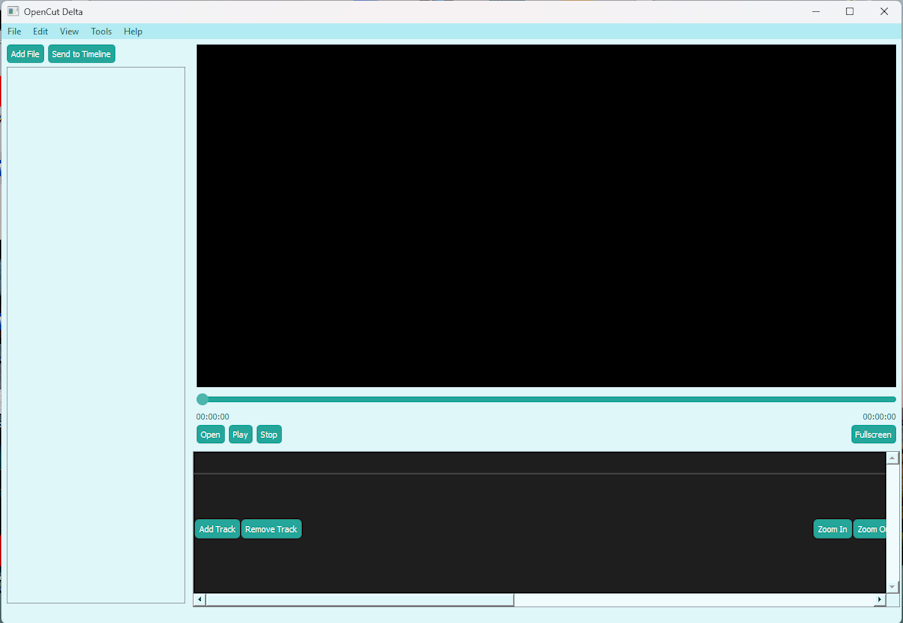
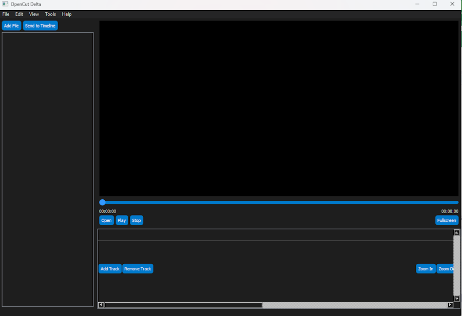

# 🎬 OpenCut - Open Source Video Editor

> **Delta Version v1.0.0**  
> A lightweight, simple, and cross-platform video editor built with Python & PyQt5.  
> Open to contributors — developers, designers, and testers welcome!

 
 


---

## 🌟 What is OpenCut?

**OpenCut** is an open-source video editor designed for beginners and casual users who want a simple way to cut and trim videos — without complexity, watermarks, or heavy system usage.

We're currently in the **Delta development phase**, and we invite developers and contributors to help us build a stable, powerful, and beautiful editor for everyone.

---

## ✨ Features (v1.0.0 Delta)

✅ 10 stunning color themes (day, night & eye-comfort modes)  
✅ Supports most video & image formats (MP4, AVI, MOV, MKV, JPG, PNG, etc.)  
✅ Clean and intuitive user interface  
✅ Standard keyboard shortcuts (Ctrl+Z, Space, etc.)  
✅ Thumbnail previews for media files  
✅ Extremely lightweight — low CPU & RAM usage  
✅ Cross-platform: Windows, macOS, Linux

---

## 🔧 In Development

🔧 Building a **custom timeline panel** for precise editing  
🔧 If custom timeline fails, we’ll integrate a free/open-source alternative  
🔧 Improving performance and UI responsiveness

---

## 🚀 Release Roadmap

| Version | Purpose | Status |
|--------|--------|--------|
| **Delta** | Active development & testing | `v1.0.0` (current) |
| **Beta v1.0.79** | Testing with community | Translation (Arabic, French, Chinese), Text & Video Effects |
| **Stable** | Final public release | `.exe` installer & portable version |

---

## 🖼 Screenshots

>
  
*Main interface with Soft Purple theme*

  
*10 themes to suit all tastes and lighting conditions*

---

## ⚙️ How to Run (For Developers)

### Requirements:
- Python 3.8 or later
- PyQt5
- moviepy, opencv-python, numpy

### Installation:
```bash
git clone https://github.com/KinanCodeaz/opencut.git
cd opencut
pip install -r resources/requirements.txt
python main.py

🤝 How to Contribute 

We need your help! Whether you're a: 

    💻 Developer: Fix bugs, add features, improve the timeline
    🌍 Translator: Help add Arabic, French, or Chinese
    🎨 Designer: Create new themes, icons, or UI improvements
    🐛 Tester: Report bugs and suggest UX fixes
     

👉 Read the full guide: CONTRIBUTING.md  
Steps: 

    Fork the repo
    Create a branch: git checkout -b feature/name
    Commit: git commit -m "Add new feature"
    Push: git push origin feature/name
    Open a Pull Request
     

Every contribution counts! 
 
💖 Support the Project 

OpenCut is free and open source, but development takes time and resources.
You can help us continue by: 

    🐛 Reporting bugs
    ✨ Suggesting features
    🌍 Translating
    💬 Joining discussions
    💰 Donating:
     

    

Or support via Open Collective  
 
📄 License 

This project is open source under the MIT License.
See LICENSE  for details. 
 

    🚀 Built with ❤️ by KinanDev
    Version: Delta v1.0.0 | Next: Beta v1.0.79